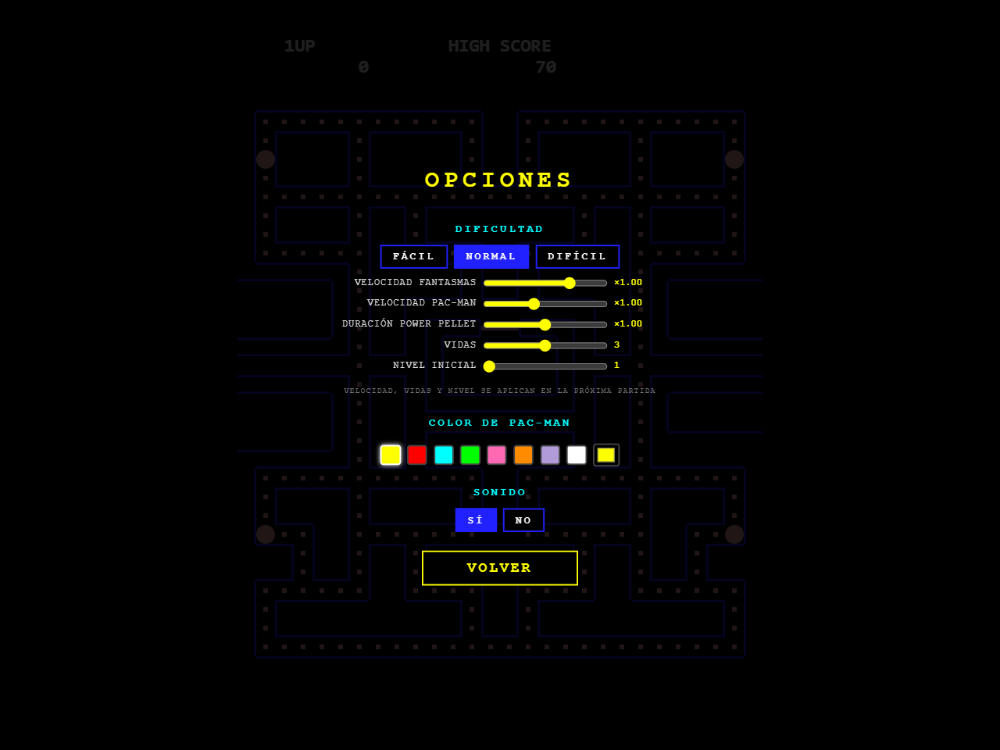

# PAC-MAN · Top Mundial

Recreación fiel del Pac-Man arcade de 1980, construida desde cero en JavaScript
vanilla (HTML5 Canvas + Web Audio API). Sin dependencias, sin build, sin
servidor: un solo doble clic y a jugar.

| Menú | Partida | Opciones |
|------|---------|----------|
|  |  |  |

## Cómo jugar

- **Windows**: doble clic en `jugar.bat` (levanta un servidor local y abre el navegador), o simplemente abre `index.html` directamente.
- **Cualquier sistema**: `python -m http.server 8264` en la carpeta y visita `http://localhost:8264`.
- **Controles**: flechas o WASD para moverte · `P` para pausa.

## Características

**Fidelidad al arcade original** — mecánicas implementadas según el comportamiento documentado de la máquina de 1980:

- Laberinto original de 28×31 con sus 244 puntos, túnel lateral y casa de fantasmas.
- Las cuatro personalidades reales de los fantasmas: Blinky (persecución directa), Pinky (emboscada 4 casillas por delante, incluyendo el bug de desbordamiento del arcade al mirar hacia arriba), Inky (vector doblado desde Blinky) y Clyde (huye a menos de 8 casillas).
- Ciclos scatter/chase con los tiempos exactos por nivel, reversa forzada en cada cambio de modo, zonas de no-subida y desempate de direcciones del original.
- Tablas de velocidad por nivel, ralentización en el túnel, Cruise Elroy, contadores de salida de la casa de fantasmas (personales, globales tras perder vida, y temporizador de seguridad).
- Frutas en 70 y 170 puntos comidos, cadena de fantasmas 200/400/800/1600, vida extra a los 10 000, niveles infinitos con la curva de dificultad del arcade.
- Sonido 100 % sintetizado en tiempo real con Web Audio API: melodía de inicio, waka-waka, sirenas progresivas, modo asustado, ojos volviendo a casa, muerte, fruta y vida extra.

**Personalización:**

- **Dificultad**: presets Fácil / Normal / Difícil + ajustes finos (velocidad de fantasmas y de Pac-Man, duración del power pellet, vidas, nivel inicial).
- **Color de Pac-Man**: 8 colores rápidos + selector libre. Se aplica en vivo.
- Configuración y récord guardados automáticamente en el navegador (localStorage).

## Estructura

```
index.html      Página principal
css/style.css   Estilos y escalado pixel-perfect
js/config.js    Constantes, laberinto y tablas del arcade
js/audio.js     Síntesis de sonido (Web Audio API)
js/sprites.js   Sprites dibujados por código
js/pacman.js    Jugador
js/ghost.js     IA de los fantasmas
js/game.js      Bucle principal y máquina de estados
js/ui.js        Menús, opciones y selector de color
SPEC.md         Especificación técnica completa
```

## Nota legal

Proyecto educativo sin ánimo de lucro. Todo el código, los gráficos
(dibujados proceduralmente) y la música (composición original) de este
repositorio son originales; no contiene ningún recurso extraído del juego
original. PAC-MAN es una marca registrada de Bandai Namco Entertainment.
Este proyecto no está afiliado ni respaldado por Bandai Namco.
