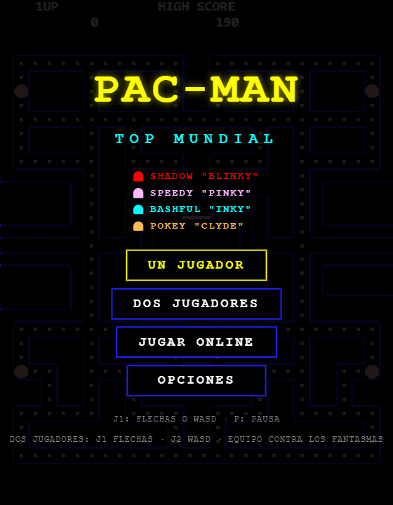
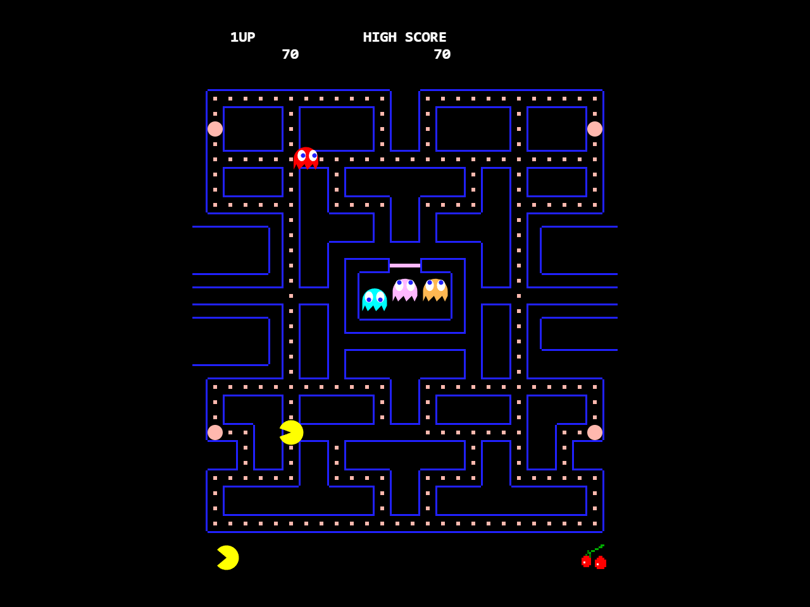
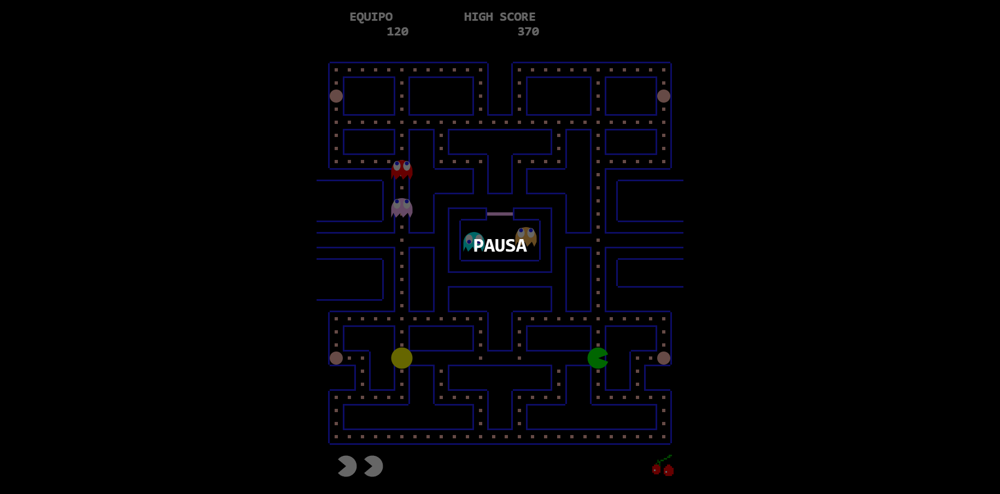
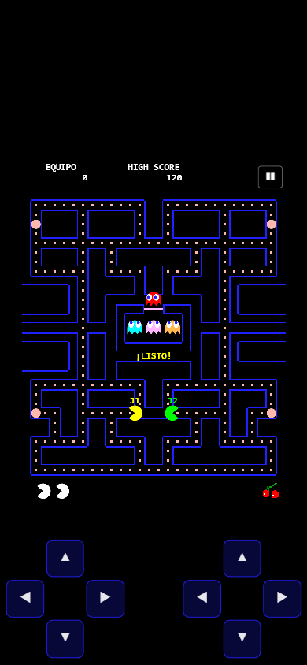

# PAC-MAN · Top Mundial

Recreación fiel del Pac-Man arcade de 1980, construida desde cero en JavaScript
vanilla (HTML5 Canvas + Web Audio API). Sin dependencias, sin build, sin
servidor: un solo doble clic y a jugar. Con modo de **dos jugadores en la misma
máquina** y modo **online de hasta cuatro** en equipo contra los fantasmas,
con **partys** que no se deshacen entre partida y partida.

| Menú | Partida | Equipo online | Móvil |
|------|---------|----------------------|-------|
|  |  |  |  |

Historial de novedades: [CHANGELOG.md](CHANGELOG.md)  ·  Lo que queda por hacer: [PENDIENTE.md](PENDIENTE.md)

## Instalar en el móvil

Abre <https://pacman-topmundial.vercel.app> y usa **«Añadir a pantalla de
inicio»** (Chrome: menú ⋮ → Instalar app; iPhone: Compartir → Añadir a
pantalla de inicio). Se abre a pantalla completa, sin barra del navegador, y
**funciona sin conexión** — solo las salas online y el top mundial necesitan
red.

## Cómo jugar

- **Windows**: doble clic en `jugar.bat` (levanta un servidor local y abre el navegador). Se puede abrir `index.html` directamente, pero entonces el navegador bloquea la lectura de los audios y las **voces de racha no suenan**; el resto del juego funciona igual.
- **Cualquier sistema**: `python -m http.server 8264` en la carpeta y visita `http://localhost:8264`.
- **Controles**: flechas o WASD para moverte · `P` o `Esc` abren el **menú de
  pausa** (semitransparente, se sigue viendo el laberinto): REANUDAR
  (`P`/`Esc`), REINICIAR (`R`) y SALIR (`Q`). Online, reiniciar lo tenéis que
  aceptar los dos.
- **Los menús se manejan con las flechas**: mueven el foco y `Enter` acepta;
  en los deslizadores, izquierda y derecha ajustan el valor.
- **Dos jugadores (local)**: J1 con las flechas, J2 con WASD.
- **Modo HABILIDADES**: solo flechas para moverte, y `Q` `W` `E` `R` para los
  cuatro poderes (en el móvil, los cuatro botones de abajo a la derecha).
- **Ver una repetición**: `P`/`Esc` la pausa (con velocidad, reiniciar y
  salir), y arriba hay una barra con los mismos controles a mano.
- **Rendirse**: botón `RENDIRSE` arriba a la derecha. En dos jugadores (local
  u online) la partida solo termina si **lo aceptan los dos**.
- **Al terminar**: cuando acaban las celebraciones, el GAME OVER resume lo
  que te llevas —puntos, experiencia y nivel de jugador, y los logros de esa
  partida— y ofrece **otra partida con tu mismo dúo** (en online, aceptándolo
  los dos) sin pasar por el menú ni volver a crear sala.
- **Móvil / táctil**: cruceta de botones en pantalla y/o deslizar sobre el
  laberinto — lo que prefieras; botón `❚❚` para pausar. En dos jugadores
  locales hay dos crucetas (esquinas inferiores: izquierda J1, derecha J2)
  y el deslizamiento va por mitades de pantalla, con multitáctil real. El
  modo online va perfecto en móvil: comparte el enlace de la sala por
  WhatsApp y el otro entra directo.

## Modos de juego

En la portada están **los seis en una rejilla**: eliges uno y le das a
`JUGAR`. Cada tarjeta te dice de qué va y lo que conviene saber antes de
entrar (si el reto de hoy ya está jugado, cuánta gente hay en tu party...).

- **Un jugador** — el arcade clásico.
- **Dos jugadores (misma máquina)** — cooperativo simultáneo contra los
  fantasmas, en el mismo laberinto. Puntuación de equipo (un solo marcador y
  récord propio de 2 jugadores). Vidas **compartidas** (fondo común, por
  defecto) o **individuales** (quien las pierde queda de espectador),
  configurable en OPCIONES. Cada fantasma persigue al jugador vivo más
  cercano manteniendo su personalidad original. **Si muere uno, la partida
  no se detiene**: reaparece a los pocos segundos (con un momento de
  invulnerabilidad) mientras el otro sigue jugando; el laberinto solo se
  reinicia cuando caen los dos.
- **Online (2, 3 o 4 jugadores)** — las mismas reglas de equipo, cada uno
  desde su casa. Uno crea una **party** y comparte el código de 4 letras (o
  el enlace directo); los demás se unen. El líder fija la dificultad y decide
  cuándo empezar; cada jugador lleva su propio color. Con 3 y 4, los dos
  jugadores extra salen **arriba** del laberinto, no a tu lado.
- **HABILIDADES** — el mismo laberinto con cuatro poderes, cada uno con su
  tecla y su recarga. En solo y en party (en la party lo enciende quien
  manda y vale para todo el grupo).
  - **Q · MORDISCO** (16 s): te comes al fantasma que tengas a una casilla,
    mires hacia donde mires, y te giras hacia él.
  - **W · TURBO** (24 s): x1.5 de velocidad durante 5 s.
  - **E · FLASH** (32 s): tres casillas **atravesando muros** hacia la última
    flecha que pulses —mire Pac-Man hacia donde mire—, comiéndote lo que haya
    por el camino.
  - **R · GRITO** (60 s): los cuatro fantasmas se asustan 6 s sin
    superpastilla.

  Aquí **se mueve solo con las flechas** (la W es el turbo). Es un modo
  aparte: estas partidas **no entran en el top mundial ni hacen récord**,
  pero sí suman experiencia y logros.

### Partys, amigos y espectar

- **La party no se deshace**: se entra una vez y el grupo sigue junto al
  volver al menú o al acabar la partida, así que se pueden encadenar
  partidas sin volver a pasar el código. El botón del menú indica
  `PARTY (n/4)`. Desde dentro: invitar, empezar, volver al menú sin salirse
  o salir del todo.
- **La lista de AMIGOS**: cada uno con su avatar y su nombre, y un botón
  `OPCIONES` que despliega qué hacer con él (ver su perfil, ver su partida,
  invitarlo o quitarlo).
- **Invitar a un amigo por su nombre**: aunque no esté en la party, le llega
  un aviso para entrar. También está en las opciones de su ficha en AMIGOS.
- **Ver la partida de un amigo**: `VER PARTIDA` en su ficha le pregunta dónde
  está jugando y entras solo a mirar (sin Pac-Man, sin chat y sin voto); lo
  que veas no cuenta como partida tuya. Vale **juegue como juegue**: en party,
  online o él solo en su casa. **Tu party sigue en pie mientras miras**: se ve
  por un canal aparte, así que no hay que salirse del grupo, y si los tuyos
  arrancan una partida dejas de mirar y entras con ellos.
- **Ver el perfil de un amigo**: `VER PERFIL` en su ficha enseña su avatar, su
  nivel, su experiencia, sus récords y sus logros con el progreso de cada
  uno. Hace falta que tenga cuenta.
- **Si alguien se cae con 3 o 4 jugadores, la partida no se corta**: quien
  se va o pierde la conexión pasa a espectador y el resto sigue.

### Configurar el modo online

El modo online usa **Supabase Realtime** como canal de comunicación (solo
canales de difusión: no crea tablas ni escribe en la base de datos). Para
activarlo, copia la URL y la clave *anon/publishable* de tu proyecto de
Supabase (Dashboard → Settings → API) en `js/net-config.js`:

```js
window.PM.NET_CFG = {
  SUPABASE_URL: 'https://tuproyecto.supabase.co',
  SUPABASE_KEY: 'sb_publishable_... o eyJ...'
};
```

Sin credenciales, el resto del juego funciona igual; solo crear party o
unirse queda deshabilitado. Para probar el online en local sin Supabase,
abre dos (o hasta cuatro) pestañas con `?red=local` en la URL.

### El TOP MUNDIAL

Las clasificaciones usan la tabla `ranking` del mismo proyecto de Supabase,
**ya creada y en marcha**, con la columna `jugadores` para separar los cuatro
formatos —individual (1), dúo (2), trío (3) y escuadra (4), cada uno con su
tabla y sus nombres en `nombre1..nombre4`— y `tiempo1` para el récord de
velocidad del primer nivel (en
centésimas de segundo; va a `null` en las partidas que no cuentan para esa
clasificación). Si alguna vez hay que recrearla o ponerla al día, el script
está en [`supabase/ranking.sql`](supabase/ranking.sql): **Dashboard → SQL
Editor → New query**, pegar y *Run* (se puede ejecutar las veces que haga
falta). Deja lectura e inserción públicas, sin permiso para modificar ni
borrar. Si la tabla falta, el panel TOP MUNDIAL lo avisa y el resto del juego
funciona con normalidad.

Las puntuaciones **ya no las escribe el navegador**: pasan por la Edge
Function [`enviar-record`](supabase/functions/enviar-record/index.ts), que
comprueba que la partida cuadre (techo de puntos del nivel, tiempo, fantasmas,
nombre y ajustes de siempre) antes de guardarla, y es la única que puede
escribir en la tabla. El SQL que le quita ese permiso a la clave anónima está
en [`supabase/ranking-integridad.sql`](supabase/ranking-integridad.sql) y se
aplica **después** de desplegar la función.

### Las cuentas

Usan **Supabase Auth** por REST, sin librerías. El jugador solo ve usuario y
contraseña: el correo que Supabase exige se compone por dentro
(`usuario@cuentas.pacman-topmundial.vercel.app`) y no se enseña en ninguna
parte. Las tablas (`perfiles` y `amigos`, con RLS: cada uno solo escribe lo
suyo) están en [`supabase/cuentas.sql`](supabase/cuentas.sql).

En la cuenta viaja **todo lo que se puede perder**: avatar, experiencia, los
**cuatro récords** (solo, dúo, trío y escuadra), el mejor tiempo del nivel 1 y
los contadores de los logros. Al entrar se funde con lo del navegador
quedándose con lo mejor de cada lado, así que entrar nunca cuesta progreso.
Las maestrías no se guardan en ninguna lista: cada ruta se deduce del récord
de su formato, así que con los récords viajan las insignias.

> Si vienes de una versión anterior, **vuelve a lanzar `cuentas.sql`**: añade
> `record3` y `record4` (trío y escuadra). El archivo se puede ejecutar las
> veces que haga falta. Mientras no se lance, el juego sigue funcionando: se
> guarda lo de siempre y lo nuevo entra en cuanto estén las columnas.

**Ajuste obligatorio del proyecto**, que no se puede hacer por SQL —
*Authentication → Sign In / Providers*:

- **Email**: activado
- **Allow new users to sign up**: activado
- **Confirm email**: **apagado**

Con la confirmación encendida el alta no devuelve sesión, y como ese buzón no
existe, el enlace no llega nunca y nadie puede entrar.

## Pruebas

Dos maneras de correr la misma batería:

- **En el navegador**: abre `tests.html` desde el servidor, igual que el juego.
  El resultado queda también en `window.__TESTS`. Ojo: tras editar algo de
  `js/`, levanta el servidor en un **puerto nuevo** o el navegador te servirá
  la versión anterior del fichero (caché heurística) y estarás probando el
  código viejo sin enterarte.
- **Sin navegador**: `node pruebas-node.js`. Monta un DOM de mentira y corre
  lo mismo; sale con código 1 si falla alguna, así que vale para CI. Lo único
  que se salta son las comprobaciones que cuentan píxeles dibujados.

## Características

**Fidelidad al arcade original** — mecánicas implementadas según el comportamiento documentado de la máquina de 1980:

- Laberinto original de 28×31 con sus 244 puntos, túnel lateral y casa de fantasmas.
- Las cuatro personalidades reales de los fantasmas: Blinky (persecución directa), Pinky (emboscada 4 casillas por delante, incluyendo el bug de desbordamiento del arcade al mirar hacia arriba), Inky (vector doblado desde Blinky) y Clyde (huye a menos de 8 casillas).
- Ciclos scatter/chase con los tiempos exactos por nivel, reversa forzada **al instante** en cada cambio de modo (como el arcade, sin esperar al centro de la casilla), zonas de no-subida y desempate de direcciones del original.
- Los fantasmas **piensan una casilla antes**: al entrar en una casilla ya deciden por dónde saldrán, así que miran a Pac-Man medio paso antes del cruce. De ahí que a veces "se equivoquen", y es lo que sostiene los patrones memorizados.
- Tablas de velocidad por nivel, ralentización en el túnel, Cruise Elroy, contadores de salida de la casa de fantasmas (personales, globales tras perder vida, y temporizador de seguridad).
- Comer puntos frena a Pac-Man **exactamente** lo que lo frenaba el original: corre a su velocidad normal y pierde un fotograma por punto, que es de donde sale la columna «Pac-Man (dots)» de las tablas (71% en el nivel 1).
- **El azar es reproducible**: los fantasmas azules huyen según un contador que se reinicia con cada nivel, igual que en la máquina. Sin eso no habría patrón que valiera, porque cada intento saldría distinto.
- Frutas en 70 y 170 puntos comidos, cadena de fantasmas 200/400/800/1600, vida extra a los 10 000, niveles infinitos con la curva de dificultad del arcade.
- La colisión es **compartir casilla y nada más**, como en la máquina: si Pac-Man y un fantasma se cruzan de frente e intercambian casilla en el mismo fotograma, se atraviesan. Es un fallo del arcade de 1980, pero se respeta a propósito — los patrones del original cuentan con él.
- Sonido sintetizado en tiempo real con Web Audio API: melodía de inicio, waka-waka, sirenas progresivas, modo asustado, ojos volviendo a casa, muerte, fruta y vida extra.
- **Voces de racha**: al comer fantasmas seguidos con el mismo energizante suenan «el hueso», «el diablo», «el huesaso» y «el diablo coño». Es lo único grabado del juego (en `audio/`), y en dúo la racha cuenta para el equipo.

**Personalización:**

- **Dificultad**: presets Fácil / Normal / Difícil + ajustes finos (velocidad de fantasmas y de Pac-Man, duración del power pellet, vidas, nivel inicial).
- **Nombres de jugador** (12 caracteres): se escribe en la propia portada
  —el tuyo, que es también el que ve tu rival online— y en OPCIONES está
  además el del jugador 2 local. Aparecen en el marcador, sobre cada Pac-Man
  al empezar, en la sala online y en el panel de fin de partida.
- **Colores de los dos jugadores**: 8 colores rápidos + selector libre por jugador. Se aplican en vivo.
- **Skins**: CLÁSICO, SOMBRA, OJOS, NEÓN, ARO y PÍXEL, combinables con
  cualquier color. Se **ganan subiendo de nivel de jugador** (3, 7, 12, 20 y
  30, en ese orden); las que faltan salen apagadas con el nivel que piden. La
  que ya llevabas puesta no se te quita nunca. **La tuya se elige en PERFIL**,
  junto al avatar; en OPCIONES está la del jugador 2 local.
- **Perfil**: avatar (16, dibujados por código: Pac-Man y sus caras, los
  cuatro fantasmas, el asustado, los ojos, frutas y la medalla), tu skin,
  nombre, nivel con su barra y un resumen de logros, maestría y récord. De
  invitado hay un botón para **sortear un nombre** al azar.
- **Logros**: 33, y **cada modo tiene los suyos**. 15 valen jugando a lo que
  sea (de un doblete de fantasmas a comerte 1000, despejar niveles sin morir,
  frutas, partidas o hacer el nivel 1 en menos de 1:30) y los otros 18 son de
  un modo concreto: tres del CLÁSICO, tres de PARTY, tres del RETO DE HOY,
  tres de LABERINTOS, tres de PAC-MAN VS. (cazar Pac-Man llevando un fantasma)
  y tres de HABILIDADES (mordiscos y muros atravesados con el flash).
  **Salen todos en la misma lista**, y cada uno dice delante en qué modo hay
  que conseguirlo. Se celebran en la partida y se siguen en PERFIL con su
  barra de progreso.
- **Maestrías**: seis insignias por ruta (de APRENDIZ a TOP MUNDIAL) y **seis
  rutas independientes**: una por formato (solo, dúo, trío y escuadra) y una
  para LABERINTOS y otra para HABILIDADES, que se juegan con otras reglas.
  Cada una lleva su propio récord, así que una gran partida en escuadra no
  regala las de solo, ni una en otro laberinto las del de 1980. Cuanto más
  regala el modo, más pide: los formatos multiplican por los jugadores y
  HABILIDADES pide el doble.
- **Cuenta con usuario y contraseña** (opcional): guarda nivel, logros,
  maestrías, récords y amigos, y te los lleva a cualquier sitio. No pide
  correo. El usuario es también tu nombre en el juego. Al entrar, lo de la
  nube y lo de este navegador se funden quedándose con lo mejor de cada lado.
  De invitado se juega igual, pero sin lista de amigos.
- **Emotes**: seis caras de Pac-Man (risa, llanto, enfado, susto, guiño y
  amor) con las teclas `1`–`6`, en el color de tu jugador. **Están animadas**:
  caen las lágrimas, el enfadado echa humo, el guiño abre el ojo con un
  chispazo, los corazones laten... Y **chat** (`T`) en el modo online.
- **Maestrías**: seis insignias por récord personal, en **cuatro rutas
  independientes** —en solo, en dúo, en trío y en escuadra—, con su propio
  panel en el menú: la lista a la izquierda y, a la derecha, **la elegida en
  grande**. Se pulsa la que quieras y se ve; al entrar sale sola la que
  tienes. Cada formato lleva **su propio récord y su propio listón**: el
  escalón de siempre multiplicado por los jugadores (APRENDIZ son 3.000 en
  solo y 12.000 en escuadra), porque el marcador de un equipo es de todos y
  con cuatro se llega al mismo número con mucho menos mérito de cada uno. En
  partida sale el cartel animado **la primera vez que consigues cada una**, no
  cada vez que cruzas el escalón; y jugando con más gente se celebra en una
  banda estrecha arriba, sin taparle el laberinto a nadie. Con
  **`Ctrl`+`Espacio`** (o el botón MI MAESTRÍA) enseñas la del modo que estés
  jugando sobre tu Pac-Man —con la medalla subiendo y la chapa
  desplegándose—, y en online la ven los demás. **Cuanto más alta es la
  maestría, más se celebra**: APRENDIZ sube y ya está; CAZADOR gira y suelta
  chispas; EXPERTO añade el destello; MAESTRO, onda expansiva y chispas
  cayendo; LEYENDA, rayos girando, estrellas en órbita y el nombre
  escribiéndose letra a letra; y TOP MUNDIAL, además, fogonazo y corona.
  **Y la chapa cambia de forma**: rectángulo hasta CAZADOR, esquinas cortadas
  en EXPERTO, hexágono en MAESTRO y, en los dos de arriba, la medalla montada
  en un **escudo** del que sale la cinta —liso en LEYENDA; más grande, con
  doble filo y **coronado** en TOP MUNDIAL—.
- **Top mundial**: clasificaciones compartidas entre todos —**individual**,
  **dúo** y **nivel 1** (quién lo despeja en menos tiempo)—, con la mejor
  marca de cada jugador. Hace falta tener nombre puesto (y sin palabrotas)
  para registrar un récord. La de velocidad se manda **en cuanto despejas el
  primer nivel**, así que cuenta aunque después te maten o te salgas, y solo
  vale a un jugador, sin red y con los ajustes de siempre: con los fantasmas
  frenados o Pac-Man acelerado la marca no sería comparable con la de nadie.
- **Tus partidas**: historial de las últimas 15, con o sin nombre y con o sin
  conexión. Lo de este navegador está siempre; **con cuenta**, además, se
  traen las que quedaron en el top mundial, así que el historial te sigue del
  ordenador al móvil. Las de otro aparato no traen repetición: esa se graba
  donde se jugó.
- **Repeticiones**: cada partida se graba sola y se puede **volver a ver**
  desde TOP MUNDIAL → TUS PARTIDAS, con el botón `VER` de cada partida.
  Sale el cartel de REPETICIÓN y controles para **pausar, ir a x2, empezarla
  otra vez o salirse**. Ver una repetición no cuenta para nada: ni
  experiencia, ni logros, ni récord. Y **se comparten por enlace**: la
  partida entera cabe en la URL, así que se manda por WhatsApp y al otro se
  le abre el juego reproduciéndola. Se guardan las últimas 8 de este
  navegador más la de tu mejor récord.
  **Las partidas online también se graban**, pero de otra manera: allí la
  partida la simula el anfitrión, así que lo que se guarda es lo que él
  reparte, y al verla el juego se pone de espectador de un archivo en vez de
  una sala. Se ven igual desde TUS PARTIDAS —las graba quien hace de
  anfitrión— pero pesan bastante más, así que se quedan **las dos últimas** y
  esas **no caben en un enlace**.

### PAC-MAN VS. — llevar un fantasma

Hasta ahora los cuatro fantasmas los llevaba la máquina. Ahora uno de vosotros
puede ponerse en su lugar.

**En la party.** Entra en JUGAR ONLINE, crea o únete a una party y, debajo de
la lista, elige en JUGAR COMO FANTASMA. Puedes coger a BLINKY, PINKY, INKY o
CLYDE; el que ya lleve otro te sale apagado. Con PAC-MAN vuelves a lo de
siempre. Alguien tiene que quedarse de Pac-Man: si no, no se puede empezar.

**En el mismo teclado.** En OPCIONES · PARTIDA · PAC-MAN VS. eliges el fantasma
del jugador 2. Luego, en DOS JUGADORES, él lo lleva con WASD y tú tu Pac-Man con
las flechas.

**Cómo se juega con un fantasma.** Se mueve como los otros tres: no atraviesa
paredes, no puede darse la vuelta a mitad de pasillo, hay cruces donde ningún
fantasma puede subir y en el túnel se arrastra. Cuando alguien se come un
energizante te toca huir: te pones azul, te pueden comer y vuelves a casa hecho
ojos hasta que sales otra vez por la puerta. Para que no se te confunda con la
máquina llevas una punta encima todo el rato, y tu nombre al empezar.

**Quién gana.** Los Pac-Man puntúan como siempre, con su marcador de equipo. Tú
te llevas 1000 puntos por cada Pac-Man que cazas, y ganas la ronda si te quedas
con todas sus vidas; si la partida acaba de cualquier otra forma, ganan ellos.
El panel del final lo dice claro.

**Ojo:** estas partidas no entran en el TOP MUNDIAL ni tocan tu récord ni tus
maestrías (con un fantasma que piensa no es la misma partida). El NIVEL DE
JUGADOR sí sube: cuenta lo que hayas hecho tú, cazando o comiendo.

- **Reto de hoy** — la misma partida para todo el mundo: mismo azar
  (fantasmas y fruta salen igual en la de cualquiera) y los ajustes de
  siempre, para que las marcas se puedan comparar. Cambia cada día a la
  vez en todo el planeta (se cuenta en UTC) y hay **un intento al día**:
  la marca se cierra cuando acaba la partida, te rindas o te salgas. El
  intento es **uno para todos tus aparatos** —el hueco del día lo guarda el
  servidor—, así que jugarlo en el móvil después de jugarlo en el PC no vale:
  el juego lo dice antes de empezar. Se juega sin cuenta —basta con tener
  nombre— y **sin conexión**: la marca se guarda y se manda sola cuando
  vuelve la red. La clasificación del día está en TOP MUNDIAL → RETO DE HOY,
  con tu puesto.
- **Laberintos** — dos o tres trazados nuevos de 28×31, con su túnel, su
  casa de fantasmas y sus energizantes en las cuatro esquinas. Es un modo
  aparte: **el laberinto original no se toca nunca**, así que estas
  partidas no entran en el top mundial (experiencia sí).
- **Top mundial**: clasificaciones compartidas entre todos —una **por
  formato** (individual, dúo, trío y escuadra), **nivel 1** (quién lo
  despeja en menos tiempo) y **reto de hoy**—, con la mejor marca de cada
  jugador o equipo; en las de equipo entran todos los nombres, y si cambia
  uno es otro equipo. Las cuatro de puntos se reparten
  por **temporadas** (el mes natural, calculado de la fecha): pestañas
  ESTA TEMPORADA e HISTÓRICO, sin perder nada de lo anterior. Hace falta
  tener nombre puesto (y sin palabrotas) para registrar un récord. La de
  velocidad se manda **en cuanto despejas el primer nivel**, así que
  cuenta aunque después te maten o te salgas, y solo vale a un jugador,
  sin red, en el laberinto clásico y con los ajustes de siempre.
Hay dos scripts más, que se ejecutan igual (Dashboard → SQL Editor → New
query → Run) y también se pueden repetir sin miedo:

- [`supabase/temporadas.sql`](supabase/temporadas.sql) — añade la
  temporada a la tabla `ranking` como columna **calculada** de la fecha y
  crea la vista por meses. No borra ni modifica ninguna fila: las partidas
  que ya estaban entran solas en el mes que les tocaba.
- [`supabase/reto.sql`](supabase/reto.sql) — crea la tabla del **reto
  diario** y su vista, con lectura e inserción públicas, y guarda **un hueco
  por nombre y día**: el segundo intento del día lo rechaza la base de datos.

Si falta alguna, el panel lo dice y el resto del juego funciona con
normalidad.

> Si vienes de una versión anterior, **vuelve a lanzar `reto.sql`**: es lo que
> pone el intento único. Antes lo decidía el navegador, y bastaba con jugar en
> el PC y otra vez en el móvil para mandar la mejor de las dos. Al ejecutarlo
> se queda **una marca por nombre y día** —la mejor, que es la que la
> clasificación ya venía enseñando— y se retira el freno viejo de tres
> envíos.

Las partidas **no se escriben directamente en la tabla**: se mandan a una
Edge Function del proyecto, `enviar-record`, que las revisa antes de
guardarlas y que es la única con permiso para escribir. Así, una puntuación
inventada desde la consola del navegador no llega a ninguna parte.

Para que una partida entre en el TOP MUNDIAL:

- Los puntos tienen que ser **alcanzables** para el nivel al que se llegó, los
  fantasmas comidos y el tiempo jugado.
- El nombre tiene que ser **de verdad y publicable** (las mismas reglas de
  siempre, hasta 12 letras).
- Hay que jugar con **los ajustes de siempre**: con los fantasmas más lentos,
  Pac-Man más rápido, los energizantes más largos o más de tres vidas, la
  partida se juega igual, pero no entra en la clasificación mundial. Jugar
  con el juego más difícil sí cuenta.
- Y como antes, **cinco partidas por nombre y minuto** como mucho.

Si algo de eso falla, el panel de GAME OVER lo dice y la partida sigue su
curso: el historial local guarda todas, entren o no.

Para instalarlo en un proyecto nuevo, el orden importa: **primero** se
despliega la función y **después** se ejecuta
[`supabase/ranking-integridad.sql`](supabase/ranking-integridad.sql) (los
pasos exactos están en la cabecera del archivo). Al revés, el ranking se
queda un rato sin nadie que pueda escribir en él.

---
- **Nivel de jugador**: mide **cuánto juegas**, no si haces récord. Los
  puntos de todas tus partidas suman experiencia —500 puntos suman 500— y
  cuentan **acabe como acabe la partida**: game over, rendición, reinicio o
  salirte a medias. Cada nivel cuesta más que el anterior y no hay tope.
- **Amigos**: lista para guardar con quién sueles jugar, invitarlos a tu
  party y ver sus partidas.
- **Cronómetro** en partida, con el tiempo transcurrido.
- **Vidas en 2 jugadores**: compartidas (por defecto) o individuales.
- **Volumen por tipo de sonido**: general, música, efectos, ambiente (sirena
  y modo azul) y voces, cada uno por separado en OPCIONES → SONIDO.
- Configuración y récords (1 jugador y equipo) guardados automáticamente en el navegador (localStorage).

**Multijugador online (arquitectura):**

- El **anfitrión** simula la partida completa (fantasmas, contadores, fruta,
  puntuación) y emite instantáneas ~12 veces por segundo.
- El **invitado** simula su propio Pac-Man en local — sin lag de entrada — y
  refleja el resto; come puntos y fantasmas con predicción local que el
  anfitrión confirma.
- Salas con código de 4 letras sobre canales de difusión de Supabase
  Realtime (cliente Phoenix/WebSocket propio, sin librerías). La **party y
  la partida comparten canal**, por eso el grupo sigue conectado en el menú;
  además cada jugador escucha un canal propio con su nombre, por donde le
  llegan las invitaciones. Desconexiones detectadas con aviso: con dos
  jugadores se vuelve al menú, con tres o cuatro solo cae el que falla.
- **Rendición y revancha por votación**: cualquiera propone, el otro acepta o
  rechaza (20 s de plazo); el anfitrión ejecuta la decisión y la reparte. La
  sala sigue viva tras el GAME OVER para poder encadenar partidas.

## Estructura

```
index.html        Página principal
css/style.css     Estilos y escalado pixel-perfect
js/config.js      Constantes, laberinto y tablas del arcade
js/audio.js       Sonido: síntesis (Web Audio) y voces de racha
audio/            Voces de racha (los únicos archivos de audio)
js/sprites.js     Sprites dibujados por código
js/pacman.js      Jugador
js/ghost.js       IA de los fantasmas
js/net-config.js  Credenciales de Supabase (online y top mundial)
js/net.js         Transporte en tiempo real (Supabase Realtime / local)
js/party.js       Partys persistentes, invitaciones y arranque de grupo
js/badges.js      Maestrías (insignias por récord personal)
js/history.js     Historial local de partidas
js/level.js       Nivel de jugador (experiencia acumulada)
js/friends.js     Lista de amigos
js/ranking.js     Top mundial (tabla de Supabase vía REST)
js/temporadas.js  Temporadas del top mundial (mes natural)
js/reto.js        Reto diario (la misma partida para todos)
js/mazes.js       Laberintos alternativos (modo aparte)
js/versus.js      PAC-MAN VS.: el fantasma que lleva un jugador
js/habilidades.js modo HABILIDADES: los cuatro poderes de Q, W, E y R
js/game.js        Bucle principal, máquina de estados y sincronización
js/replay.js      Repeticiones: grabar, reproducir, guardar y compartir
js/ui.js          Menús, opciones, panel de party, paneles y controles
manifest.json     App instalable (PWA)
sw.js             Service worker: funciona sin conexión
icons/            Iconos de la app
tests.html        Pruebas automáticas (ábrelo como el juego)
supabase/         SQL de la tabla y la vista del ranking
SPEC.md           Especificación técnica completa
CHANGELOG.md      Historial de cambios
PENDIENTE.md      Lo que queda por hacer, y por qué
```

## Nota legal

Proyecto educativo sin ánimo de lucro. Todo el código, los gráficos
(dibujados proceduralmente) y la música (composición original) de este
repositorio son originales; no contiene ningún recurso extraído del juego
original. PAC-MAN es una marca registrada de Bandai Namco Entertainment.
Este proyecto no está afiliado ni respaldado por Bandai Namco.
